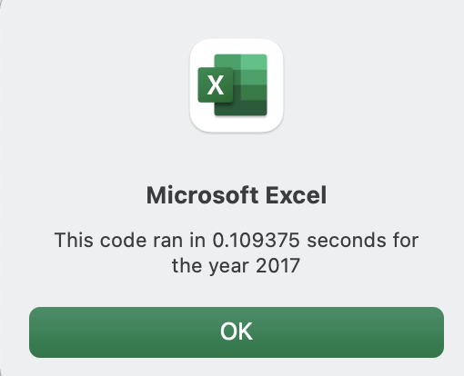
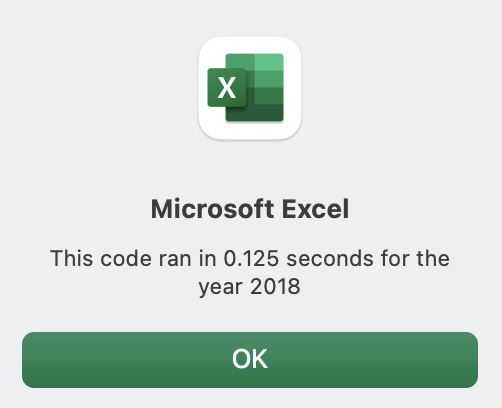
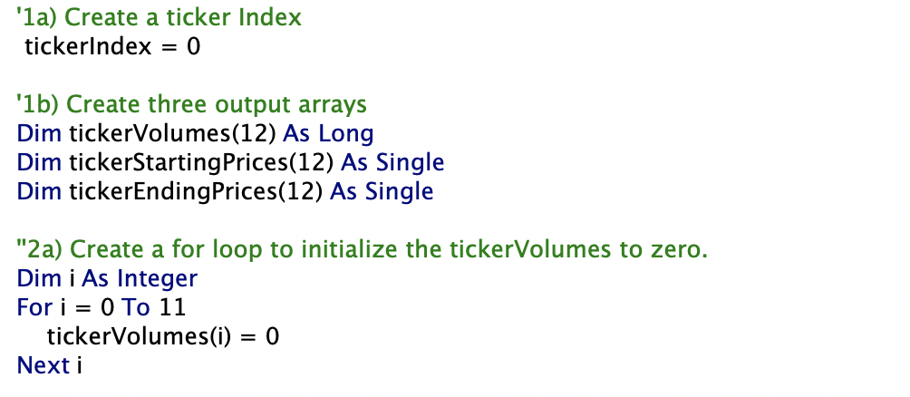
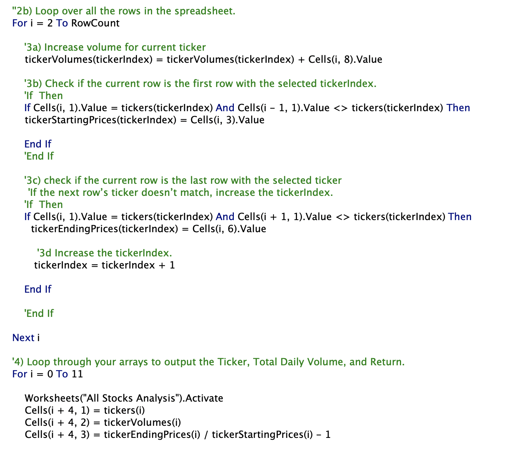

# Stock Analysis
## Project Overview
Client asked for a macro to run to determine a stock's volume and return for any given year.  After writing a code that will perform this operation, the next stage was to refactor the code to make it more efficient.  The end goal was to decrease the run time to account for a longer list of stocks under evaluation.

## Results
The first step in the refactoring process was to rewrite the code that calculated the volumes and returns line by line for a given ticker.  The first iteration of the code used two loops: the first loop cycled through the tickers array to perform the calculations for each ticker.  The second loop cycled through the given year's data and performed the calculations.  This code took over 70,000 seconds to run with a relativelly small dataset. This suggested a refactored code would be needed to handle much large datasets without crashing the system.  

Refactoring simplified the code and decrease calculation time while retaining the same calculation results.  See improved time stamps below.

First, the two loops were condensed into one loop through the use of an Index variable.  This variable was set to 0 at the onset and stood as a placeholder for the ticker array numbers (0-11).  

After the loop performed the volume and return calculations for a given ticker array number, the loop added 1 to the Index so that the next iteration would perform the calculations for the next ticker array number. 

## Summary
Refactoring the code can have a few disadvantages such as causing the code to break or even making the code take longer to run.  Perhaps too, the code could be easier to follow because their are more steps. On the other hand, advantages include creating code that runs more efficiently and is simplified.  Refactoring the code also can enable the system to handle more data without crashing.

These disadvantages and advantanges are seen in the refactoring process.  While the refactored code is simplief and runs faster, understanding the how the code runs takes longer because steps are condensed with the refactoring.
